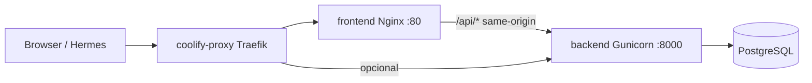

# Arquitetura de produção — Coolify + Docker Compose

## Diagnóstico: por que só falha em produção?

Em dev local, backend e frontend rodam direto (uvicorn + vite). Em produção, há **mais camadas** entre o usuário e a API:



Quando a API “some”, quase sempre é um destes pontos — **não** bug de lógica da aplicação:

| Camada | Sintoma | Causa típica |
|--------|---------|--------------|
| **Traefik (coolify-proxy)** | 504 em **todos** os sites do servidor | Outro app com domínio sem porta (`port is missing`) — ex.: Hermes gateway/dashboard |
| **Release duplicada** | 504 intermitente | Dois pares `frontend-*` / `backend-*` ativos |
| **Frontend “healthy”** | Site abre, login/API falha | Healthcheck só testava `/` (HTML), não o proxy `/api` |
| **Backend lento no start** | 504 após deploy | Migrations + Gunicorn > `start_period` do healthcheck |
| **Upstream errado** | API falha após redeploy Coolify | Nginx apontava para `backend:8000` fixo; Coolify renomeia para `backend-<id>` |
| **Cache de DNS do Nginx** | API some após redeploy do backend, volta só reiniciando o frontend | Nginx resolvia o IP do backend uma única vez no boot; container novo = IP novo nunca resolvido |

> O cache de DNS foi corrigido com `resolver 127.0.0.11 valid=10s` + variável no `proxy_pass` (re-resolução a cada 10s).

---

## Coolify “verde” mas o site não abre

Isso é **esperado** no cenário de proxy quebrado. O Coolify **não testa** o domínio público.

| O que o Coolify verifica | O que o usuário acessa |
|--------------------------|-------------------------|
| Container rodando | HTTPS via **coolify-proxy (Traefik)** |
| Healthcheck **dentro** do container (`127.0.0.1`) | Rota DNS → proxy → container |
| Status “Running (healthy)” | Pode ser **504** mesmo com tudo verde |

### Matriz de diagnóstico (rode no servidor)

```bash
curl -fsS --max-time 10 http://127.0.0.1:3001/health/api && echo LOCAL=OK || echo LOCAL=FAIL
curl -fsS --max-time 15 https://alugueis.kbosolucoes.com.br/health/api && echo PUBLIC=OK || echo PUBLIC=FAIL
```

| LOCAL | PUBLIC | Significado | Ação |
|-------|--------|-------------|------|
| OK | OK | Tudo certo | — |
| OK | **FAIL** | **Proxy/Traefik** (app saudável, rota externa quebrada) | `docker restart coolify-proxy`; corrigir Hermes `port is missing` |
| FAIL | FAIL | Container/app | Redeploy; ver logs backend/frontend |
| FAIL | OK | Raro (cache DNS/CDN) | Investigar CDN |

O Coolify fica verde no caso **LOCAL=OK, PUBLIC=FAIL** — porque o healthcheck só bate em `127.0.0.1` dentro do container.

### Watchdog (detecção automática)

Script que testa **URL pública** (não só localhost) e reinicia o proxy quando detecta divergência:

```bash
chmod +x scripts/prod-watchdog.sh
# teste manual:
./scripts/prod-watchdog.sh alugueis.kbosolucoes.com.br 3001

# cron a cada 3 min (root no servidor):
# */3 * * * * /caminho/sist-alugueis/scripts/prod-watchdog.sh >> /var/log/sist-alugueis-watchdog.log 2>&1
```

Mitigação temporária. A **causa raiz** continua sendo eliminar `port is missing` no Traefik (Hermes gateway/dashboard).

---

## Configuração recomendada no Coolify (sua tela General)

### Frontend Domain
- **Domínio:** `https://alugueis.kbosolucoes.com.br`
- **Porta do container:** `80`
- **Health check:** path `/health/api` (valida Nginx **e** backend)
- **Variáveis:**
  ```env
  VITE_API_BASE_URL=/api/v1
  RUN_SEED=false
  ```
- Não defina `BACKEND_UPSTREAM` manualmente — o entrypoint usa `SERVICE_NAME_BACKEND` do Coolify.

### Backend Domain (Hermes / integrações externas)
- **Domínio:** `https://alugueis-api.kbosolucoes.com.br` *(opcional, só se Hermes chamar direto)*
- **Porta do container:** `8000`
- **Health check:** path `/health/ready`
- **Importante:** se não precisar de URL pública no backend, **remova** o Backend Domain — o SPA usa same-origin via frontend.

### Variáveis compartilhadas (stack)
```env
ALLOWED_ORIGINS=https://alugueis.kbosolucoes.com.br,https://alugueis-api.kbosolucoes.com.br
POSTGRES_PASSWORD=<segredo>
JWT_SECRET_KEY=<segredo>
RUN_SEED=false
FRONTEND_PORT=3001
```

---

## O que mudou no `docker-compose.prod.yml`

1. **Removido `container_name` fixo** — evita conflito entre releases no Coolify.
2. **Aliases de rede** `backend` e `db` — DNS estável dentro do compose.
3. **`start_period: 120s` no backend** — tempo para migrations + Gunicorn.
4. **Healthcheck do frontend em `/health/api`** — falha se o backend estiver inacessível.
5. **`SERVICE_NAME_BACKEND`** — upstream dinâmico após redeploy.
6. **Limites de memória** — reduz OOM silencioso no host compartilhado.
7. **Entrypoint espera Postgres** antes de rodar Alembic (até 90s).

---

## Checklist pós-deploy

```bash
chmod +x scripts/prod-check.sh
./scripts/prod-check.sh alugueis.kbosolucoes.com.br alugueis-api.kbosolucoes.com.br 3001
```

Critérios:
- [ ] Apenas **1** par `frontend-*` / `backend-*`
- [ ] `curl https://alugueis.../health/api` → JSON `ready`
- [ ] Logs do proxy **sem** `port is missing`
- [ ] Hermes (igznwa): gateway/dashboard **sem** domínio público ou **com porta** definida

---

## Fluxo de tráfego (SPA vs Hermes)

**Usuário no browser:**
```
https://alugueis.kbosolucoes.com.br/api/v1/...
  → Traefik → frontend:80 → nginx proxy → backend:8000
```

**Hermes Agent (externo):**
```
https://alugueis-api.kbosolucoes.com.br/api/v1/...
  → Traefik → backend:8000 (direto)
```

O frontend **nunca** chama `alugueis-api.*` — usa `/api/v1` same-origin. CORS só importa para Hermes e ferramentas externas.

---

## Checklist final de aplicação (executar em ordem)

### A. No Coolify — projeto `sistema-alugueis`
1. **Redeploy** (puxa o commit com as melhorias)
2. Frontend → **Health check**: path `/health/api`, porta `80`
3. Backend → **Health check**: path `/health/ready`, porta `8000`
4. Variáveis: `RUN_SEED=false`, `VITE_API_BASE_URL=/api/v1`
5. Não definir `BACKEND_UPSTREAM` manualmente

### B. No Coolify — projeto Hermes (`igznwa...`) — CAUSA RAIZ
1. Serviço **gateway**: remover domínio público (ou definir porta correta)
2. Serviço **dashboard**: remover domínio público (ou definir porta correta)
3. **Save** + **Redeploy** do Hermes

### C. No servidor (SSH)
```bash
# 1. Reiniciar o proxy após corrigir o Hermes
docker restart coolify-proxy
sleep 15

# 2. Confirmar que a causa raiz sumiu (deve vir VAZIO)
docker logs --since 5m coolify-proxy 2>&1 | grep 'port is missing'

# 3. Remover releases duplicadas, se houver (manter só 1 par frontend/backend)
docker ps --format 'table {{.Names}}\t{{.Status}}' | grep -E 'frontend-|backend-'

# 4. Validação completa
cd /caminho/sist-alugueis
chmod +x scripts/prod-check.sh scripts/prod-watchdog.sh
./scripts/prod-check.sh alugueis.kbosolucoes.com.br alugueis-api.kbosolucoes.com.br 3001

# 5. Instalar watchdog (detecta "Coolify verde + site fora" e reinicia o proxy)
crontab -e
# adicionar:
# */3 * * * * /caminho/sist-alugueis/scripts/prod-watchdog.sh >> /var/log/sist-alugueis-watchdog.log 2>&1
```

### D. Validação final (browser)
- [ ] `https://alugueis.kbosolucoes.com.br` abre e login funciona
- [ ] `https://alugueis.kbosolucoes.com.br/health/api` retorna JSON `ready`
- [ ] Rodapé mostra `Rev.` igual ao SHA do deploy
- [ ] Hermes continua acessando `https://alugueis-api.kbosolucoes.com.br` (se aplicável)

---

## Referências

- [Passo a passo 504](./passo-a-passo-corrigir-504-coolify.md)
- [Versionamento e deploy](./runbook-incidente-504-cors-e-versionamento-coolify.md)
